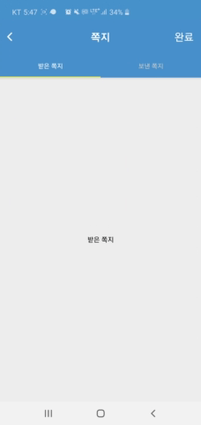

### react native tab navigation 

[main link](https://reactnavigation.org/docs/en/tab-based-navigation.html)
[npm link](https://www.npmjs.com/package/react-navigation-tabs)

#### INSTALL
npm install --save react-navigation-tabs

#### SCREENSHOT 

#### EXAMPLE CODE 
~~~
/**
 * https://www.youtube.com/watch?v=hWMn32erJ2g
 * youtube example
 */

import React, {useState} from 'react';
import { View, StyleSheet, Text, SafeAreaView, Alert } from 'react-native';
import { createMaterialTopTabNavigator } from 'react-navigation-tabs';
import { createAppContainer } from 'react-navigation';

const MessageScreen = ({navigation})=>{

    /**
     * firstScreen 
     */
    const firstScreen = () => {
        return (
            <View style={{flex:1,justifyContent:'center',alignItems:'center'}}>
            <Text>first Screen</Text>
        </View>
        )
    }
    /**
     * SecondScreen = 보낸 쪽지
     */
    const SecondScreen = () => {
        return (
            <View style={{flex:1,justifyContent:'center',alignItems:'center'}}>
                <Text>Second Screen</Text>
            </View>
        )
    }
    /**
     * top bar navigation
     */
    const navigator = createMaterialTopTabNavigator({
        '받은 쪽지':firstScreen,
        '보낸 쪽지':SecondScreen,
    },{
        tabBarOptions:{
            activeTintColor:'#fff',
            inactiveTintColor:'#ccc',
            showIcon:false,
            pressOpacity:1,
            pressColor:'rgb(66,141,208)',
            style:{backgroundColor:'rgb(66,141,208)'}
        }
    })
    const Index = createAppContainer(navigator);

    return (

        <SafeAreaView style={styles.container}>
        <View style={styles.header}>
            <Icon onPress={()=>{navigation.goBack()}} style={{color:'#fff',fontSize:26, position:'absolute',left:15,}} name='ios-arrow-back'/>
            <Text style={styles.title}>쪽지</Text>
            <Text onPress={()=>{Alert.alert('쪽지 보내기 완료')}} style={{color:'#fff',fontSize:22, position:'absolute',right:15,}}>완료</Text> 
        </View>
        <View style={styles.contents}>
            <Index style={{flex:1}}/>
        </View>

    </SafeAreaView>

    )
}

const styles = StyleSheet.create({
    container:{
        flex:1,
        justifyContent:'center',
        alignItems:'center',
    },
    containernull:{
        paddingTop: 10,
        paddingRight: 180,
    },
    SpaceContainer:{
        flex: 1,
        justifyContent: "center",
        alignItems: "center"
    },
    title:{
        fontSize:22,
        fontWeight:'bold',
        color:'#fff'
    },
    header:{
        flex:1,
        width:'100%',
        backgroundColor:'rgb(66,141,208)',
        flexDirection:'row',
        alignItems:'center',
        justifyContent:'center',
    },
    contents:{
        flex:10,
        width:'100%',
        backgroundColor:'#eee',
    },
});

export default MessageScreen;
~~~