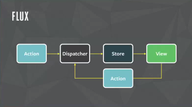

# Redux를 왜 써야되는지? 어떻게 사용하는지?
* 작성자 : 이동준
* 작성일 : 2020.01.31

## 1. Redux를 왜 쓰게 되었나?

상세보기

react native로 처음 개발을 하면서 API 호출을 위해 JWT TOKEN을 반복해서 써야되는 현상이 발생했다.

지금까지 AsyncStorage를 사용하여 문제를 해결하였지만 AsyncStorage 역시 비동기적으로 가져와야 하기 때문에 문제가 발생할 것임을 예감하고 있었다.

문제 코드
~~~
 useEffect(()=>{
        //getToken을 통해 처리하는데 문제점 발생
        const getToken = async () => {
            let t = '';
            try {
            t = await AsyncStorage.getItem('token') || '';
            } catch (error) {
            console.log(error.message);
            }
            setToken(t);
        } 
        getToken().then(()=>{
            ... 토큰을 이용한 일처리부분
        }).catch(()=>{
            console.log('Token을 가져오는 데 실패했습니다.');
        });
    },[]);
~~~

## 2. Redux란 무엇인가?

상세보기

react 생태계에서 react와 가장많이 사용되는 라이브러리 중 하나이다.
react는 View만을 책임지는 라이브러리로 데이터를 어떻게 관리할 지는 숙제로 남아있다.

Facebook은 전통적인 MVC 패턴이 큰 프로젝트에서는 적합하지 않다고 지적했다.

대표적인 사례로 Facebook Message 사건이 이 경우다. 

이미 Message를 확인을 했는데도 계속해서 메세지가 와있다고 하는 버그가 존재해 User가 불편해하고 개발자들도 많은 시간을 들여 수정을 반복했지만 결국은 패턴을 바꾸게 되는 계기가 되었다.

모델의 데이터는 다수의 컨트롤러와 뷰에 의해 수정될 수 있기 때문에 직관적으로 흐름이 보이지 않는다.

그래서 Facebook이 제안한 flux 패턴은 데이터 수정이 dispatcher 한 곳에서만 발생하도록 제약을 걸었다.

flux 패턴의 구현체인 redux 는 store 1곳만 존재한다는 제약을 걸었다.

<h2>redux의 3가지 원칙</h2>

<h3>1. store는 오직 한 개다.</h3>

전체 어플리케이션의 상태가 하나의 JSON object로 표현된다.

    <ul>
    <li>Undo/Redo 기능을 쉽게 구현 가능. 이전상태의 JSON object를 덮어쓰기만 하면 됨</li>
    <li>전체의 상태를 저장하고 불러오기 쉽다</li>
    <li>디버깅이 쉬워진다.  
        ex) 계속 가정하면서 반복하던 일을 상태를 저장해서 그 시점부터 한번의 버튼을 클릭하고 돌아가서 계속 반복하면 된다.</li>
    </ul>
 

<h3>2. store의 state는 무조건 action을 통해서만 변경할 수 있다.</h3>

action은 type과 데이터를 담고 있는 JSON object다. 상태변경의 경로가 단순하므로 애플리케이션의 동작을 이해하기 쉽다. 이것이 redux가 이론적 배경으로 삼고 있는 flux의 핵심개념이다.

 

<h3>3. reducer는 pure fuction 이다.</h3>

reducer는 action과 이전 state를 입력으로 받아 새로운 state를 리턴하는 함수이다. 같은 action과 state를 입력으로 주면 항상 같은 state를 리턴한다.  <strong>중요) : pure function으로 만들기 위해서는 함수 내부에서 global 변수를 수정하거나 랜덤 함수를 사용하면 안된다.</strong>
아래와 같은 장점을 가지고 있다.

<ul>
    <li>발생한 action을 순서대로 기억하고 있으면 언제든지 현재 상태를 만들 수 있다. 덕분에 리플레이 기능을 쉽게 구현할 수 있다.</li>
    <li>유닛테스트 코드를 작성하기 쉽다. 정해진 입력에는 항상 예상되는 출력을 준다.</li>
</ul>
 
<h2>store의 state를 수정 불가능한 변수로 만들면 성능 저하가 없나?</h2>

매번 Deep Copy를 한다면 느리다. 그래서 수정 불가능한 변수를 지원하는 라이브러리에서는 필요한 만큼만 메모리를 할당하고 나머지는 재활용한다.

var state = {
    name: 'jane',
    age: 21,
    family: [
        {
            name: 'jake',
            age: 11
        },
        {
            name: 'mike',
            age: 22
        },
    ],
};
var newState = update(state, {family: {1: {age: {$set: 30}}}});
console.log(state === newState); // false
console.log(state.family === newState.family); // false
console.log(state.family[0] === newState.family[0]); // true
console.log(state.family[1] === newState.family[1]); // false
 

<h2>모든 데이터를 redux로 관리해야 하나?</h2>

 무조건 redux로 상태관리할 필요는 없지만 다음경우는 redux로 관리하는게 좋다.

<ul>
    <li>애플리케이션 여러 곳에서 공유되는 데이터</li>
    <li>상태유지가 필요한 데이터</li>
</ul>

## 4. 이후 진행사항

redux에 대해 좀 더 자세하게 알아보도록 할 예정

## 5. 참고

1. [redux 이해하기](https://medium.com/@ljs0705/redux%EB%A5%BC-%EC%9D%B4%ED%95%B4%ED%95%98%EC%9E%90-7c9e8de0ab7f)
2. [redux authentication](https://blog.usejournal.com/persisting-user-authentication-in-a-react-native-app-778e028ac816)