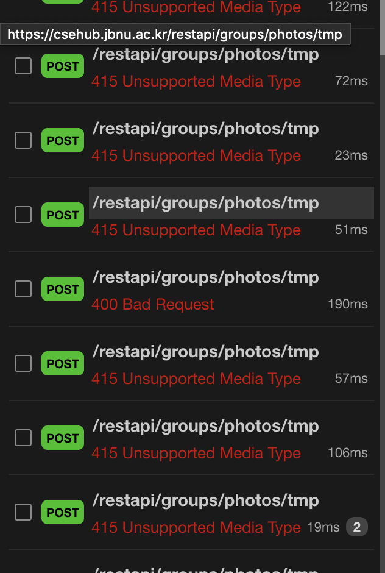
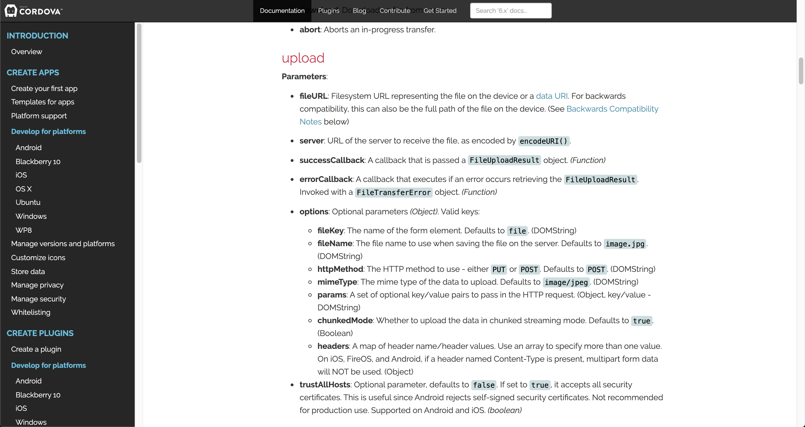
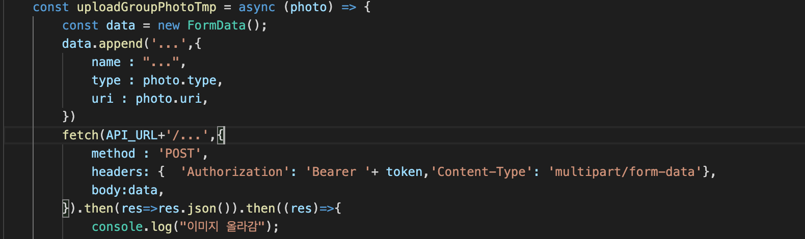
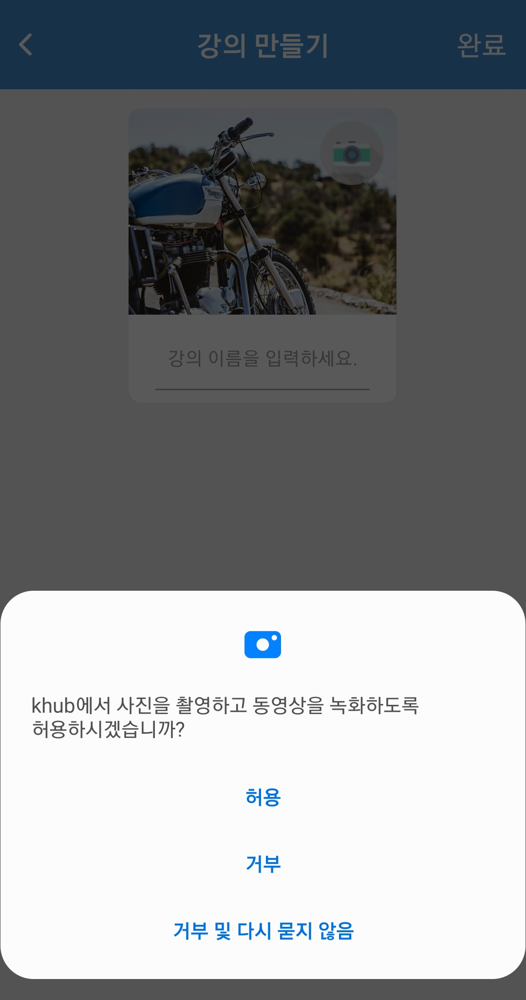

# Upload Image (이미지 업로드)
* 작성자 : 이동준
* 작성일 : 2020.02.04

## 1. 작업
-------------- 
1. 코드 refactoring 작업
2. 그룹 생성을 위한 이미지 업로드 작업 수행

## 2. 진행 과정
--------
#### 1) 불필요한 변수 사용

BEFORE
~~~
bool=false; // 파일 업로드를 수행하는 지 여부를 체크하기 위함
const GroupMakeScreen = ({navigation}) => { 
    const [filePath,setfilePath] = useState([]); // 파일 업로드 후 경로 설정변수
    ...

    {bool==false ? <Image/>:<Image/>}
 }
{bool=false}
~~~

AFTER
~~~
const GroupMakeScreen = ({navigation}) => { 
    const [filePath,setfilePath] = useState([]); // 파일 업로드 후 경로 설정변수
    ...

    {filePath.length==0 ? <Image/>:<Image/>}
 }
~~~

* 결과 : 읽기 쉽게 변수 정리 밑 코드 가독성 향상

#### 2) 이미지 업로드 작업

기존 Khub에서는 CordovaTranser를 이용하여 파일을 전송하였다. 

처음에 비슷하게 구현을 axios로 해서 진행했지만 계속적으로 에러가 발생했다.

1.문제화면
 
</img> 
정말 많은 실행을 서버코드 참고하면서 진행했는데... 계속 실패를 거듭헀다.
  
2. Cordova 기술문서에 내용 참고와 기존 코드
 
</img>
</img>
 
기존 코드속에서 Options에 대한 부분을 어떻게 처리할지 궁금했는데 Document에 설명이 잘 되어있다.
 

axios 대신 fetch를 이용해 파일 업로드를 진행 하였다.
fetch를 이용해보니 정상적으로 작동했다. (아래문서 참고!)
[React / React Naive TIPS axios 와 fetch 어떤 것을 사용할까?](https://hoorooroob.tistory.com/entry/React-React-Naive-TIPS-axios-%EC%99%80-fetch-%EC%96%B4%EB%96%A4-%EA%B2%83%EC%9D%84-%EC%82%AC%EC%9A%A9%ED%95%A0%EA%B9%8C)
</img>

## 3. 안드로이드 Permission을 얻으려면 어떻게 해야될까?
----------
#### 1. react native app에서 android > app > src > main > AndroidManifest.xml 에 들어간다.
#### 2. 아래의 permission들을 추가해 준다.
~~~
<uses-permission android:name="android.permission.CAMERA" /> // 카메라 사용
<uses-permission android:name="android.permission.READ_EXTERNAL_STORAGE" /> // 외부 스토리지 읽기
<uses-permission android:name="android.permission.WRITE_EXTERNAL_STORAGE" /> // 외부 스토리지 쓰기 
~~~
#### 3. 2번까지 수행하고 react-native run-android 수행하기 
(문제 발생시! android 폴더에서 ./grablew clean 실시)

#### 4. 실행 이미지
</img>

## 4. 향후 진행 방향
------------
1. 파일 업로드 기능이 필요한 부분에 추가적으로 업데이트 예정.

2. 코드 정리
