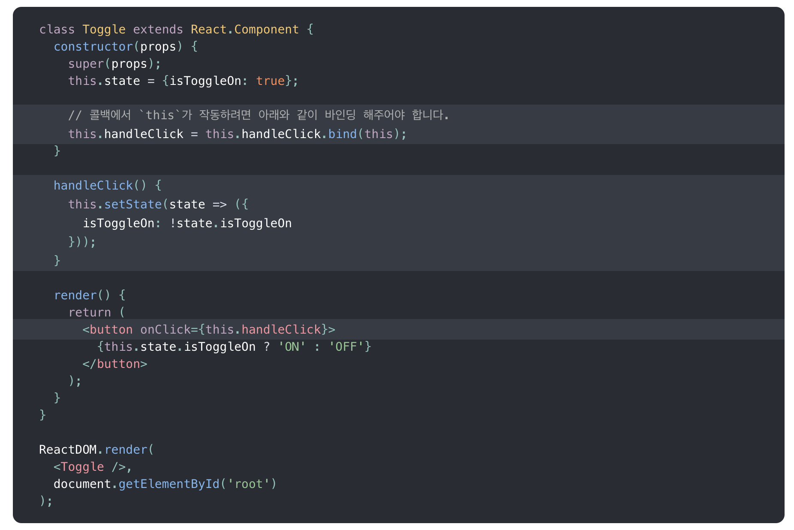
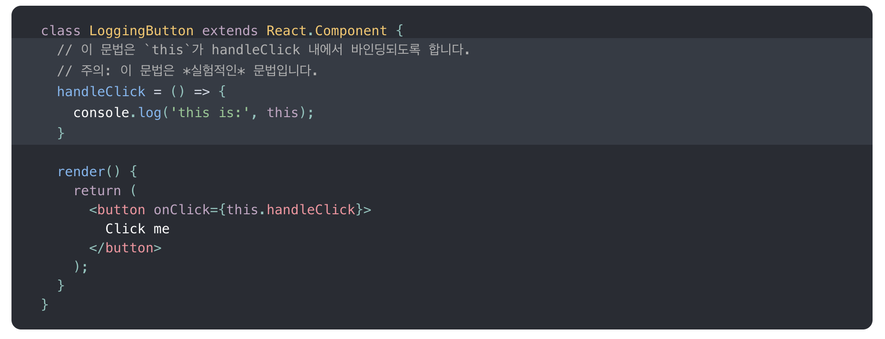
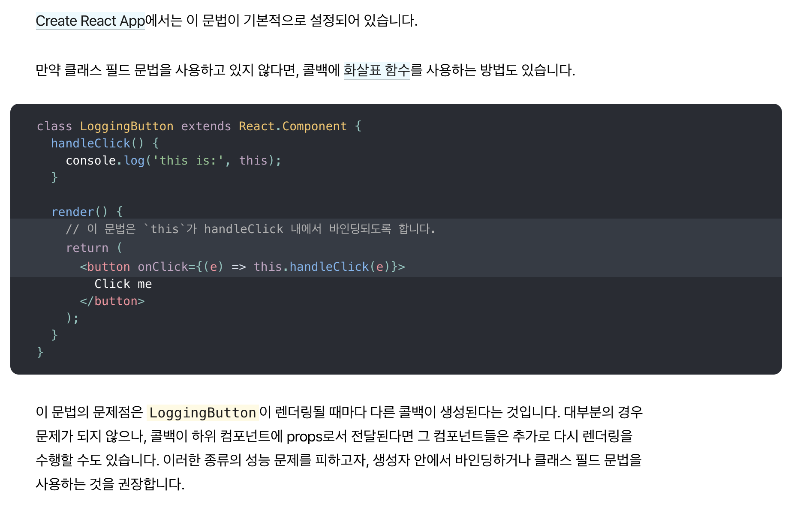
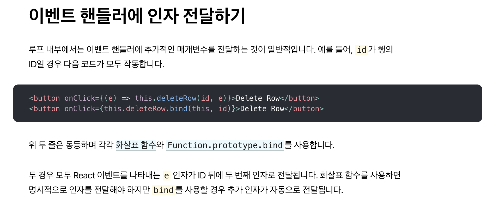

# Event Handling 
* 작성자 : 이동준
* 작성일 : 2020.02.12

## 1. 작업
-------------- 
1. 지금까지 작업한 내용을 점검하고자 공식문서를 참조하던 도중 이벤트핸들링에 대해 명확하게 알고자 찾아보게 되었다.

## 2. 진행 과정
--------

리액트 공식 문서에 보면 다음과 같이 정의되어 있다. 
[리액트 이벤트 핸들링](https://ko.reactjs.org/docs/handling-events.html)

</img>
 
기본적으로 Javascript에서 클래스 메서드는 바인딩이 되어있지 않다. this.handleClick을 바인딩 하지 않고 진행하면 실제 호출될 때는 undefined가 된다.

이는 React만의 특수한 동작이 아니며, JavaScript에서 함수가 작동하는 방식의 일부이다. 

일반적으로 onClick={this.handleClick}과 같이 뒤에 ()를 사용하지 않고 메서드를 참조할 경우, 해당 메서드를 바인딩 해야 한다.
 

#### 1. (실험적인) 퍼블릭 클래스 필드 문법

</img>
</img>
 
아래 설명에 나와있듯이 다른 콜백이 생성된다고 나와있다. 
콜백이 하위 컴포넌트에 props로서 전달된다면 그 컴포넌트들은 추가로 다시 렌더링을 수행할 수도 있다. 이러한 종류의 성능 문제를 피하고자, 생성자 안에서 바인딩하거나 클래스 필드 문법을 사용하자.

#### 2. 이벤트 핸들러에 인자 전달하기 
</img>

## 3. 앞으로 진행과정

1. khub앱 점검(class component와 functional commponent의 무분별 사용에 따른 이벤트 핸들링 점검하기)