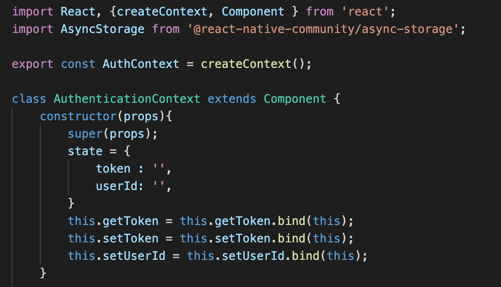
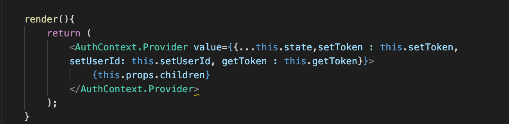
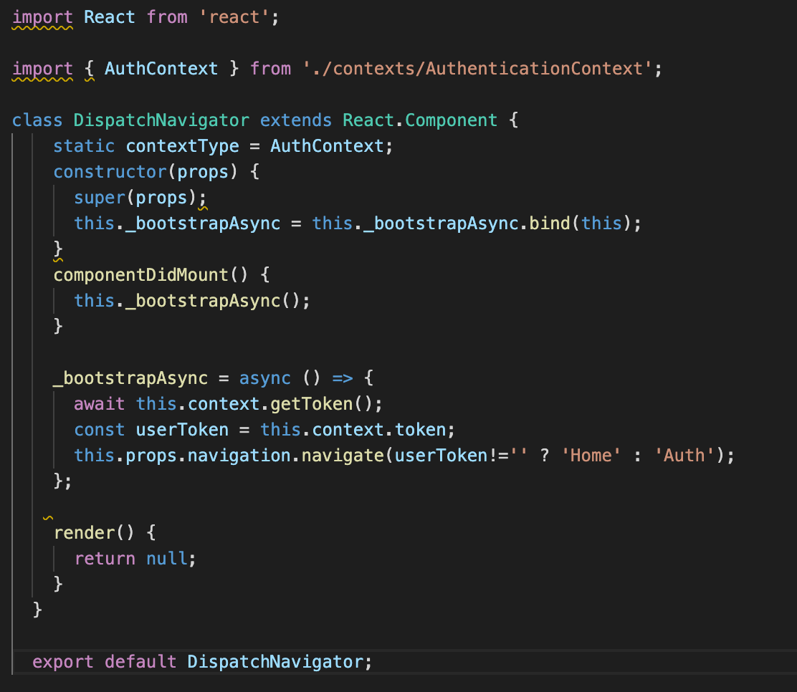
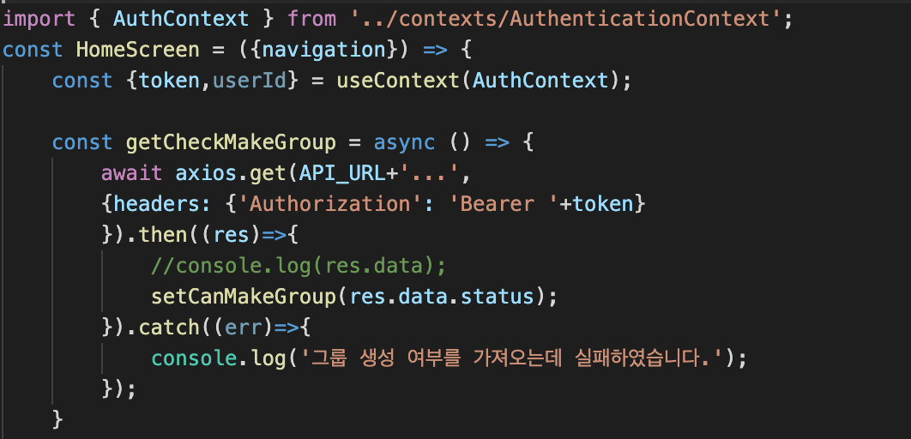

# Context API
* 작성자 : 이동준
* 작성일 : 2020.02.13

## 1. 작업
-------------- 
1. Authentication 정보를 처리하는 방법 중 redux와 고민하다가 단순 상태관리가 필요해 context를 사용하게 되었다.

## 2. 진행 과정
--------
[리액트 컨텍스트](https://ko.reactjs.org/docs/context.html)

공식 리액트를 참고해 보면 Context는 React 컴포넌트 트리 안에서 전역적(global)이라고 볼 수 있는 데이터를 공유할 수 있도록 고안된 방법입니다. 

그러한 데이터로는 현재 로그인한 유저, 테마, 선호하는 언어 등이 있습니다. 

예를 들어, 아래의 코드는 버튼 컴포넌트를 꾸미기 위해 테마(theme) props를 명시적으로 넘겨주고 있습니다.

=> 이부분에서 사용자의 인증부분도 전역적으로 가지고 있으면 좋겠다고 생각을 했다.  
=> 닭잡는데 소잡는 칼 쓰기가 싫어서 redux보다는 context를 사용한 것이 이번의 목표다.

</img> 
사용방법은 다음처럼 createContext 함수를 이용해 context를 만든다.
</img> 
위 처럼 원하는 value를 provider에 앨리먼트를 추가하면 된다.

=> 본인의 경우 이 부분을 앱이 처음 켜졌을 때, 사용자가 전에 로그인한 적이 있는지 여부를 판단해 Dispatch를 구현하려 했다.
</img> 

이렇게 한번 Context에 저장된 state는 전역적으로 사용할 수 있게 된다.

* EXAMPLE

</img> 

## 3. 장점

계속적으로 반복되어 왔던 async-storage 호출이 적어지고 auth key를 한번에 관리할 수 있는 장점이 생겼다.   
(전체 코드길이도 4/5로 줄음)

## 4. 앞으로 진행과정

1. Context의 Consumer와 provider에 대해 좀 더 사용을 해 볼 예정.
2. 간단한 Context를 넘어 [redux](../12.redux/readme.md)에 대해서도 점차적으로 알아갈 것이다.
