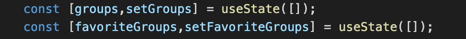
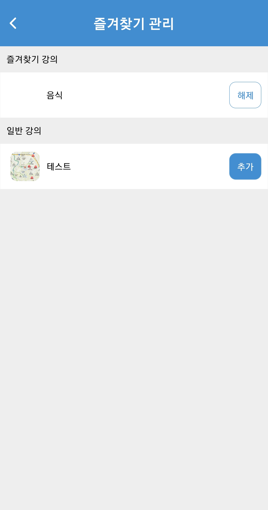
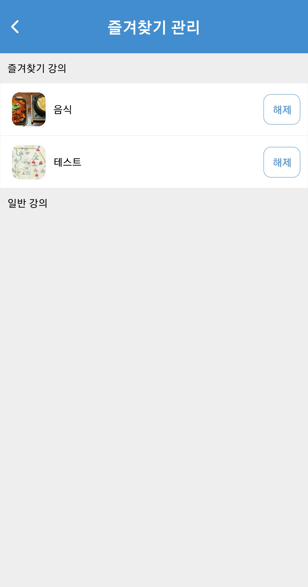
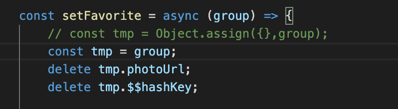
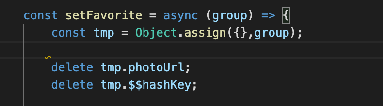
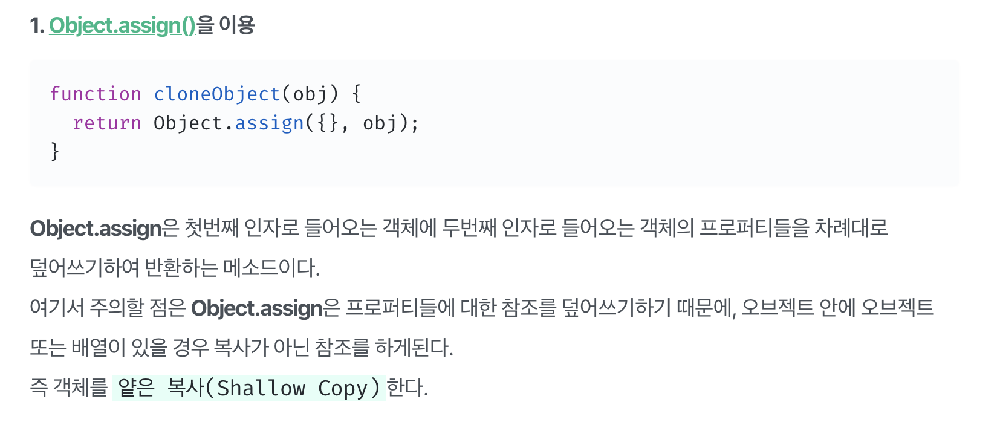

# hook useState 활용
* 작성자 : 이동준
* 작성일 : 2020.02.14

## 1. 활동
-------------- 
1. khub에서 useState를 잘 활용해서 배열을 다루는 작업을 진행했다. (2번에서 다룰예정)
2. object에서 특정 key를 삭제하는 부분에서 문제가 있었다. (3번에서 다룰예정)

## 2. 진행 과정
--------
기존에 hook을 사용해서 많은 데이터들을 처리하고 Array로 저장만 해봤지만 내부의 아이템을 수정하는 작업은 이번이 처음이였다. 
 
</img>
 
아래의 이미지는 배열에서 기존 그룹과 즐겨찾기 그룹을 설정하는 코드중 일부이다.

useState를 이용하면 prev(이전) 값을 가져올 수 있는데 아래처럼 =>(에로우) 를 이용하면 된다.

그리고 뒤에 새로 추가할 때는 "[...prevArray, new object]" 같은 형식으로 만든다.

filter의 옵션은 배열에서 특정한 값을 뺄 때 도움이 된다. 예시를 살펴보자.

ex) [1,2,3,4,5,6] => filter((e)=>(e<4)) => [1,2,3] 

다음과 같이 진행을 하여 아래의 결과를 얻었다.

</img>
 

이렇게 잘 작성하고 나니 부분적인 오류가 있었는데 추가버튼을 누르면 delete 부분에서 문제가 발생했다.
이 부분을 고친 방법을 3번에서 설명한다.

</img>
</img>

## 3. 문제점 해결방법
---------

기존에 아래와 같이 변수 tmp에 넣어 delete를 실행했더니 Object 해당 Key가 완전히 사라져서 이미지가 보이지 않았던 것
 
</img>
 
이 부분을 아래처럼 Object.assign을 통해 해결을 했다.
 
</img>
 

단 ! 주의할 점은

오브젝트 내부에 오브젝트나 배열이 들어올 경우 shallow copy가 되므로 이점 주의해서 사용하자.

 
</img>
 
