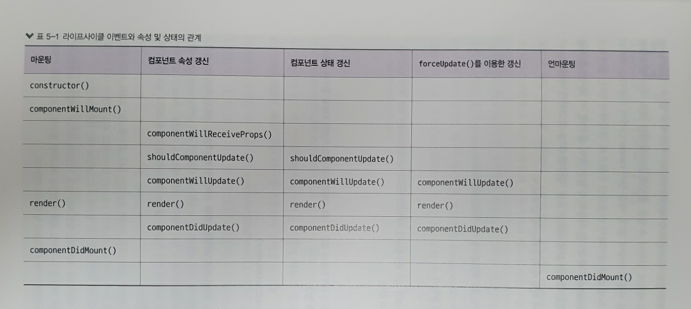

### react native life cycle

1. 라이프 사이클 이벤트 한눈에 살펴보기

    - 마운팅(mount) 이벤트 : REACT 엘리먼트를 DOM 노드에 추가할 때 발생
    - 갱신(update) 이벤트 : 속성이나 상태가 변경되어 REACT 엘리먼트를 갱신할 때, 발생함
    - 언마운팅(unmount) 이벤트 : REACT 엘리먼트를 DOM에서 제거할 때 발생

2. 이벤트 분류

    * contructor : 엘리먼트를 생성하여 props 와 state를 설정할 때, 실행
    * mounting :
        - componentWillMount() : DOM에 삽입되기전에 실행
        - componentDidMount() : DOM에 삽입되어 렌더링이 완료된 후에 실행
    * update :
        - componentWillReceiveProps(nextProps) : 컴포넌트가 속성을 받기 직전에 실행된다.
        - shouldComponentUpdate(nextProps,nextState) : 컴포넌트가 갱신되는 조건을 정의해서 재렌더링을 최적화 할 수 있다. boolean 값 반환
        - componentWillUpdate(nextProps,nextState) : 컴포넌트가 갱신되기 직전에 실행된다.
        - componentDisUpdate(prevProps,preState) : 컴포넌트가 갱신된 후에 실행된다.
    * unmounting :
        - componentWillUnmount() : 컴포넌트를 DOM에서 제거하기 전에 실행되며, 구독한 이벤트를 제거하거나 다른 정리 작업을 수행할 수 있다.

3. 관계 그림

4. 이벤트

    1. 모든 이벤트들은 DOM에 추가되고 나서부터 접근할 수 있다. (componentDidMount 이후)

